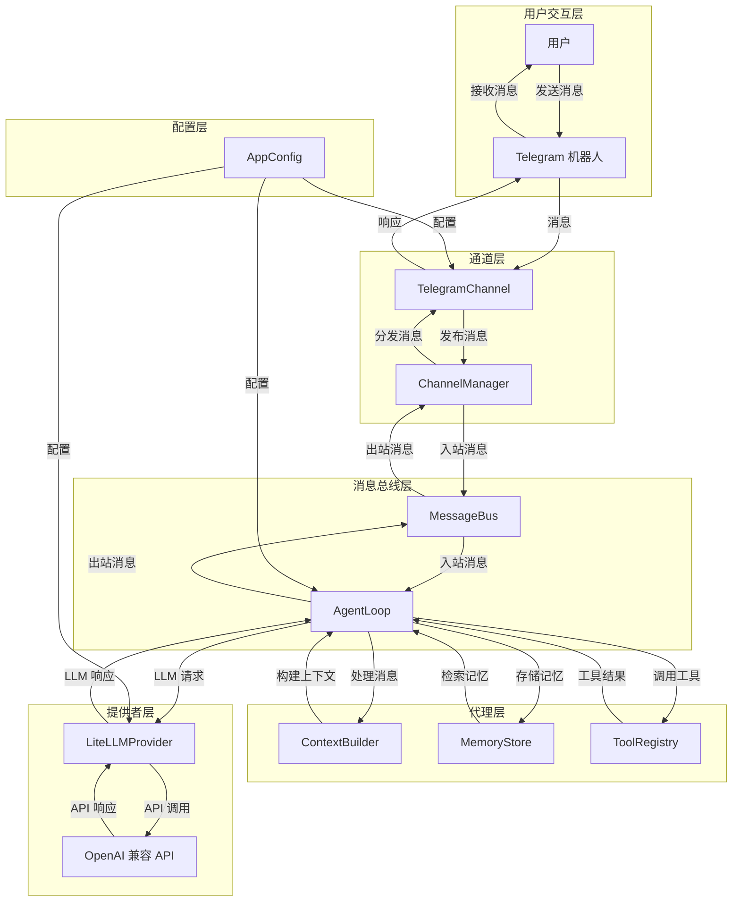

 ## OwnBot（gateway + Telegram MVP）

### 目标
- 常驻 `gateway` 进程
- Telegram long polling 收消息
- 走一个最简单的 LLM 回答（OpenAI-compatible HTTP API）

### 整体架构

OwnBot 采用模块化架构设计，各模块之间通过消息总线进行通信，实现了解耦和可扩展性。以下是整体架构图：



### 模块说明

1. **CLI 命令模块** (`ownbot/cli/`)
   - `commands.py`: 实现了 `onboard` 和 `gateway` 命令，用于初始化配置和启动服务
   - 负责解析命令行参数并启动相应的服务

2. **配置模块** (`ownbot/config/`)
   - `schema.py`: 定义了 `AppConfig`、`LLMConfig` 和 `TelegramConfig` 数据模型
   - `loader.py`: 实现了配置的加载和保存功能
   - `paths.py`: 定义了数据目录、媒体目录、日志目录等路径
   - 负责管理应用配置，确保配置的一致性和有效性

3. **消息总线模块** (`ownbot/bus/`)
   - `queue.py`: 实现了 `MessageBus` 类，用于通道和代理之间的消息传递
   - 提供了入站和出站消息队列，实现了模块间的解耦

4. **代理模块** (`ownbot/agent/`)
   - `loop.py`: 实现了 `AgentLoop` 类，处理消息处理、LLM 调用和工具执行
   - `context.py`: 实现了 `ContextBuilder` 类，构建对话上下文
   - `memory.py`: 实现了 `MemoryStore` 和 `MemoryConsolidator` 类，管理会话记忆
   - 负责处理用户消息，与 LLM 交互，并执行相应的操作

5. **提供者模块** (`ownbot/providers/`)
   - `base.py`: 定义了 `LLMProvider` 基类和相关数据结构
   - `registry.py`: 实现了 `ProviderRegistry` 类，管理 LLM 提供者
   - `litellm_provider.py`: 实现了 `LiteLLMProvider` 类，用于与 OpenAI 兼容的 API 交互
   - 负责与 LLM API 进行通信，处理 API 调用和响应

6. **通道模块** (`ownbot/channels/`)
   - `base.py`: 定义了 `BaseChannel` 抽象基类
   - `manager.py`: 实现了 `ChannelManager` 类，管理通道的生命周期和消息分发
   - `telegram.py`: 实现了 `TelegramChannel` 类，处理 Telegram 机器人的消息收发
   - 负责接收用户消息并发送响应，支持多种通信渠道

### 依赖
- Python >= 3.11

### 安装
在本目录执行：

```bash
pip install -e .
```

### 配置
运行一次 `onboard` 生成默认配置：

```bash
ownbot onboard
```

然后编辑 `~/.ownbot/config.json`（最小必填）：

```json
{
  "telegram": {
    "enabled": true,
    "token": "YOUR_TELEGRAM_BOT_TOKEN",
    "allowFrom": ["*"]
  },
  "llm": {
    "apiBase": "https://api.openai.com/v1",
    "apiKey": "sk-xxx",
    "model": "gpt-4.1-mini"
  }
}
```

### 启动 gateway

```bash
ownbot gateway
```

### 安全提示
- `allowFrom` 为空表示拒绝所有人；要公开访问请显式写 `["*"]`。
 
