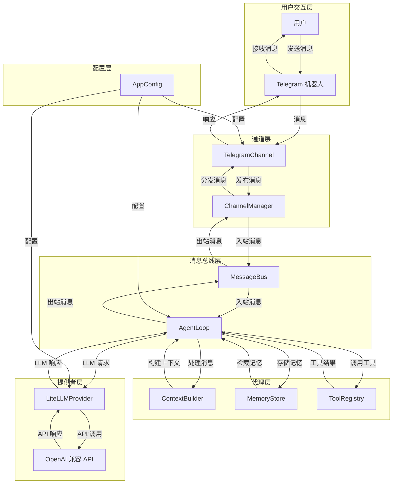

 ## OwnBot（gateway + Telegram MVP）

### 目标
- 常驻 `gateway` 进程
- Telegram long polling 收消息
- 走一个最简单的 LLM 回答（OpenAI-compatible HTTP API）

### 整体架构

OwnBot 采用模块化架构设计，各模块之间通过消息总线进行通信，实现了解耦和可扩展性。以下是整体架构图：



### 模块说明

1. **CLI 命令模块** (`ownbot/cli/`)
   - `commands.py`: 实现了 `onboard` 和 `gateway` 命令，用于初始化配置和启动服务
   - 负责解析命令行参数并启动相应的服务

2. **配置模块** (`ownbot/config/`)
   - `schema.py`: 定义了 `AppConfig`、`LLMConfig` 和 `TelegramConfig` 数据模型
   - `loader.py`: 实现了配置的加载和保存功能
   - `paths.py`: 定义了数据目录、媒体目录、日志目录等路径
   - 负责管理应用配置，确保配置的一致性和有效性

3. **消息总线模块** (`ownbot/bus/`)
   - `queue.py`: 实现了 `MessageBus` 类，用于通道和代理之间的消息传递
   - 提供了入站和出站消息队列，实现了模块间的解耦

4. **代理模块** (`ownbot/agent/`)
   - `loop.py`: 实现了 `AgentLoop` 类，处理消息处理、LLM 调用和工具执行
   - `context.py`: 实现了 `ContextBuilder` 类，构建对话上下文
   - `memory.py`: 实现了 `MemoryStore` 和 `MemoryConsolidator` 类，管理会话记忆
   - 负责处理用户消息，与 LLM 交互，并执行相应的操作

5. **提供者模块** (`ownbot/providers/`)
   - `base.py`: 定义了 `LLMProvider` 基类和相关数据结构
   - `registry.py`: 实现了 `ProviderRegistry` 类，管理 LLM 提供者
   - `litellm_provider.py`: 实现了 `LiteLLMProvider` 类，用于与 OpenAI 兼容的 API 交互
   - 负责与 LLM API 进行通信，处理 API 调用和响应

6. **通道模块** (`ownbot/channels/`)
   - `base.py`: 定义了 `BaseChannel` 抽象基类
   - `manager.py`: 实现了 `ChannelManager` 类，管理通道的生命周期和消息分发
   - `telegram.py`: 实现了 `TelegramChannel` 类，处理 Telegram 机器人的消息收发
   - 负责接收用户消息并发送响应，支持多种通信渠道

7. **会话模块** (`ownbot/session/`)
   - `base.py`: 定义了 `Session` 类，存储会话信息和消息历史
   - `manager.py`: 实现了 `SessionManager` 类，管理会话的创建、加载和保存
   - 负责持久化会话状态，确保对话连续性

8. **工具模块** (`ownbot/agent/tools/`)
   - `base.py`: 定义了 `Tool` 基类和 `ToolCall` 数据结构
   - `registry.py`: 实现了 `ToolRegistry` 类，管理可用工具
   - `filesystem.py`: 实现了文件系统相关工具（列出文件、读取文件、写入文件）
   - `shell.py`: 实现了 shell 命令执行工具
   - `web.py`: 实现了 HTTP 请求工具
   - 提供了各种工具能力，扩展了 LLM 的功能

### 实现的功能

#### 核心功能

1. **Telegram 集成**
   - 支持 Telegram 机器人的消息收发
   - 支持私聊和群聊消息处理
   - 支持消息回复和引用
   - 支持媒体消息处理（图片、语音、文档等）

2. **LLM 集成**
   - 支持 OpenAI 兼容的 API
   - 内置 LiteLLMProvider，支持多种 LLM 模型
   - 实现了 API 调用的重试机制

3. **消息总线**
   - 异步消息队列，实现模块间解耦
   - 支持入站和出站消息处理
   - 确保消息的可靠传递

4. **会话管理**
   - 持久化会话状态
   - 会话隔离存储
   - 支持会话历史管理

5. **工具系统**
   - 文件系统工具：列出文件、读取文件、写入文件
   - Shell 工具：执行系统命令
   - Web 工具：发送 HTTP 请求
   - 动态工具注册和执行

6. **智能记忆管理**
   - 会话隔离的记忆文件
   - 自动记忆巩固和压缩
   - LLM 生成的智能总结
   - 记忆文件持久化

#### 技术特性

1. **模块化架构**
   - 清晰的模块划分
   - 松耦合的设计
   - 易于扩展和维护

2. **异步处理**
   - 使用 asyncio 实现异步操作
   - 高效的消息处理
   - 支持并发操作

3. **会话隔离**
   - 每个会话有独立的目录
   - 会话文件和记忆文件完全隔离
   - 避免会话间的相互干扰

4. **智能压缩**
   - 当会话消息过多时自动巩固
   - 使用 LLM 生成会话总结
   - 保留重要信息，删除冗余内容

5. **安全机制**
   - Telegram 消息来源验证
   - 工具执行的安全限制
   - 配置的权限控制

### 工作流程

1. **消息处理流程**
   - 用户在 Telegram 发送消息
   - TelegramChannel 接收消息并解析
   - 消息通过 MessageBus 发送给 AgentLoop
   - AgentLoop 构建上下文并调用 LLM
   - LLM 生成响应
   - 响应通过 MessageBus 发送回 TelegramChannel
   - TelegramChannel 发送响应给用户

2. **会话管理流程**
   - 收到消息时，SessionManager 获取或创建会话
   - 会话保存消息历史
   - 当会话消息超过阈值时，触发记忆巩固
   - 记忆巩固生成会话总结并压缩历史
   - 会话状态持久化到磁盘

3. **记忆巩固流程**
   - MemoryConsolidator 检查会话消息数量
   - 当消息超过 50 条时，触发巩固
   - 使用 LLM 生成会话总结
   - 保存总结到记忆文件
   - 只保留最近 20 条消息
   - 生成 MEMORY.md 和 HISTORY.md 文件

### 存储结构

```
~/.ownbot/workspace/
└── sessions/
    ├── telegram_7034328084/  # 私聊会话
    │   ├── session.jsonl      # 会话文件
    │   ├── memories.json      # 记忆文件
    │   ├── MEMORY.md          # 智能总结
    │   ├── HISTORY.md         # 完整历史
    │   └── archive_2026-03-14T14:00:00.md  # 归档文件
    └── telegram_-5216315207/  # 群聊会话
        ├── session.jsonl
        ├── memories.json
        ├── MEMORY.md
        ├── HISTORY.md
        └── archive_2026-03-14T14:05:00.md
```

### 依赖
- Python >= 3.11

### 安装
在本目录执行：

```bash
pip install -e .
```

### 配置
运行一次 `onboard` 生成默认配置：

```bash
ownbot onboard
```

然后编辑 `~/.ownbot/config.json`（最小必填）：

```json
{
  "telegram": {
    "enabled": true,
    "token": "YOUR_TELEGRAM_BOT_TOKEN",
    "allowFrom": ["*"]
  },
  "llm": {
    "apiBase": "https://api.openai.com/v1",
    "apiKey": "sk-xxx",
    "model": "gpt-4.1-mini"
  }
}
```

### 启动 gateway

```bash
ownbot gateway
```

### 安全提示
- `allowFrom` 为空表示拒绝所有人；要公开访问请显式写 `["*"]`。
 
